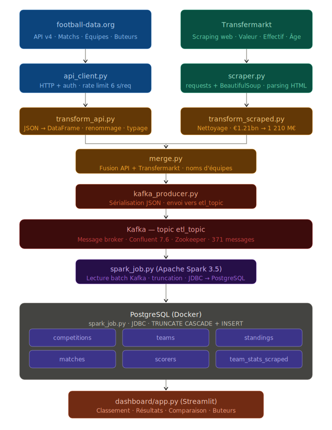

# Pipeline Big Data — Ligue 1

Pipeline de données complet : collecte → Kafka → Spark → PostgreSQL → visualisation.  
Combine une API REST et du scraping web pour alimenter un Data Warehouse PostgreSQL.

---

## Architecture globale



---

## Flux de données

```
Python (main.py)
  │
  ├── 1. INGESTION
  │     ├── collecter_classement()    → dict JSON
  │     ├── collecter_equipes()       → dict JSON
  │     ├── collecter_matchs()        → dict JSON
  │     ├── collecter_buteurs()       → dict JSON
  │     └── scraper_valeurs_marche()  → DataFrame
  │
  ├── 2. TRANSFORMATION (pandas)
  │     ├── transformer_classement()  → DataFrame (18 lignes)
  │     ├── transformer_equipes()     → DataFrame (18 lignes)
  │     ├── transformer_matchs()      → DataFrame (306 lignes)
  │     ├── transformer_buteurs()     → DataFrame (10 lignes)
  │     └── transformer_valeurs_marche() → DataFrame (18 lignes)
  │
  └── 3. ENVOI VERS KAFKA (topic: etl_topic)
        ├── competition   →  1 message
        ├── teams         → 18 messages
        ├── standings     → 18 messages
        ├── matches       → 306 messages
        ├── scorers       → 10 messages
        └── market_values → 18 messages

            ↓ Kafka (broker)

Spark (spark_job.py)
  │
  ├── Lecture batch depuis Kafka (etl_topic)
  ├── Tri des messages par type + dédoublonnage
  ├── Sauvegarde dans HDFS (hdfs://namenode:8020/data/raw/)
  │     ├── /data/raw/competition
  │     ├── /data/raw/teams
  │     ├── /data/raw/standings
  │     ├── /data/raw/matches
  │     ├── /data/raw/scorers
  │     └── /data/raw/market_values
  ├── Truncation des tables PostgreSQL (CASCADE)
  └── Chargement via JDBC
        ├── competitions       →  1 ligne
        ├── teams              → 18 lignes
        ├── standings          → 18 lignes
        ├── matches            → 306 lignes
        ├── scorers            → 10 lignes
        └── team_stats_scraped → 18 lignes

            ↓ PostgreSQL

Streamlit (dashboard/app.py)
```

---

## Schéma de la base de données

```
competitions
┌────┬──────┬──────┬──────┬──────┐
│ id │ name │ code │ area │ type │
└──┬─┴──────┴──────┴──────┴──────┘
   │
   │ 1─────────────────────────────n
   ▼
standings                               matches
┌────┬────────────────┬──────────┬─┐   ┌────┬────────────────┬─────────────┐
│ id │ competition_id │ team_id  │…│   │ id │ competition_id │ home_team_id│
│    │ season         │ position │ │   │    │ matchday        │ away_team_id│
│    │ points         │ played   │ │   │    │ utc_date        │ home_score  │
└────┴────────────────┴────┬─────┴─┘   │    │ status          │ away_score  │
                           │           └────┴────────────────┴─────────────┘
scorers                    │
┌────┬────────────────┬────▼──────┐    team_stats_scraped
│ id │ competition_id │ team_id   │   ┌────┬─────────┬──────────────────────┐
│    │ player_name    │ goals     │   │ id │ team_id │ market_value_m       │
│    │ assists        │ penalties │   │    │ season  │ squad_size  avg_age  │
└────┴────────────────┴───────────┘   └────┴─────────┴──────────────────────┘
                           │                          ▲
                           └──────────────────────────┘
                                     teams
                             ┌────┬──────┬────────────┐
                             │ id │ name │ short_name │
                             │    │ tla  │ founded    │
                             │    │ area │ venue      │
                             └────┴──────┴────────────┘
```

---

## Structure du projet

```
projet/
├── src/
│   ├── config/
│   │   └── config.py              # Clé API, connexion DB, config Kafka
│   ├── ingestion/
│   │   ├── api_client.py          # Collecte depuis football-data.org
│   │   ├── kafka_producer.py      # Envoi des données vers Kafka
│   │   └── scraper.py             # Scraping transfermarkt.com
│   ├── transformation/
│   │   ├── transform_api.py       # Nettoyage données API → DataFrames
│   │   ├── transform_scraped.py   # Nettoyage données scrapées
│   │   └── merge.py               # Correspondance noms d'équipes
│   ├── warehouse/
│   │   ├── schema.sql             # Définition des tables PostgreSQL
│   │   └── load.py                # Chargement direct (sans Kafka, pour debug)
│   ├── dashboard/
│   │   └── app.py                 # Interface Streamlit
│   ├── spark_job.py               # Job Spark : lit Kafka → HDFS + PostgreSQL
│   └── main.py                    # Orchestrateur : ingestion → transformation → Kafka
├── docker-compose.yml             # Zookeeper, Kafka, PostgreSQL, Spark, HDFS
├── requirements.txt
└── .env                           # Clé API + credentials DB (non versionné)
```

---

## Installation et lancement complet

### Prérequis
- Python 3.10+
- Docker Desktop (lancé et fonctionnel)
- Un compte sur [football-data.org](https://www.football-data.org/) pour obtenir une clé API gratuite

---

### Étape 1 — Cloner le projet

```bash
git clone https://github.com/mlft9/projet-edouard-bigdata.git
cd projet-edouard-bigdata
```

---

### Étape 2 — Créer l'environnement Python

```bash
# Créer le venv
python -m venv venv

# Activer (Windows)
venv\Scripts\activate

# Activer (Mac/Linux)
source venv/bin/activate

# Installer les dépendances
pip install -r requirements.txt
```

> **Erreur fréquente sur Windows (PowerShell)** : si vous obtenez `cannot be loaded because running scripts is disabled on this system`, exécutez cette commande une seule fois puis relancez l'activation :
> ```powershell
> Set-ExecutionPolicy -ExecutionPolicy RemoteSigned -Scope CurrentUser
> ```
> Alternativement, utilisez `cmd` à la place de PowerShell : `venv\Scripts\activate.bat`

---

### Étape 3 — Configurer les variables d'environnement

Copier le fichier d'exemple et le remplir :

```bash
cp .env.example .env
```

Contenu du `.env` à renseigner :

```env
# Clé API football-data.org (gratuite sur https://www.football-data.org/)
FOOTBALL_API_KEY=your_api_key_here
FOOTBALL_API_BASE_URL=https://api.football-data.org/v4

# PostgreSQL (laisser ces valeurs par défaut si vous utilisez Docker)
DB_HOST=localhost
DB_PORT=5433
DB_NAME=football_dw
DB_USER=postgres
DB_PASSWORD=postgres
```

---

### Étape 4 — Démarrer l'infrastructure Docker

```bash
docker compose up -d
```

Vérifier que tous les conteneurs sont bien démarrés :

```bash
docker compose ps
```

Attendre ~60 secondes que Kafka et HDFS soient complètement prêts avant de continuer.

Pour vérifier que Kafka est prêt :
```bash
docker exec kafka kafka-topics --bootstrap-server localhost:29092 --list
```
Si la commande répond (même sans output), Kafka est prêt.

---

### Étape 5 — Lancer le pipeline Python (collecte → Kafka)

```bash
python src/main.py
```

Ce script collecte les données depuis l'API et Transfermarkt, les transforme, et envoie 371 messages vers le topic Kafka `etl_topic`. Durée : ~1 minute (rate limit API gratuit).

---

### Étape 6 — Lancer le job Spark (Kafka → HDFS + PostgreSQL)

**Première fois uniquement** — préparer le conteneur Spark :

```bash
docker exec -u root spark-master bash -c "mkdir -p /home/spark/.ivy2/cache && chmod -R 777 /home/spark/.ivy2"
docker exec -u root spark-master pip install psycopg2-binary -q
```

**Lancer le job :**

```bash
docker exec spark-master /opt/spark/bin/spark-submit --master spark://spark-master:7077 --packages org.apache.spark:spark-sql-kafka-0-10_2.12:3.5.0,org.postgresql:postgresql:42.7.3 /opt/spark-apps/src/spark_job.py
```

> Le premier lancement télécharge les JARs Kafka et PostgreSQL (~1 min). Les suivants sont instantanés.

---

### Étape 7 — Lancer le dashboard

```bash
streamlit run src/dashboard/app.py
```

Ouvrir http://localhost:8501 dans le navigateur.

---

## Commandes utiles

### PostgreSQL

```bash
# Ouvrir un shell psql
docker exec -it postgres psql -U postgres -d football_dw

# Compter les lignes par table
SELECT COUNT(*) FROM competitions;
SELECT COUNT(*) FROM teams;
SELECT COUNT(*) FROM standings;
SELECT COUNT(*) FROM matches;
SELECT COUNT(*) FROM scorers;
SELECT COUNT(*) FROM team_stats_scraped;

# Classement (top 5)
SELECT position, team_name, points, played FROM standings ORDER BY position LIMIT 5;

# Meilleurs buteurs
SELECT player_name, goals, assists FROM scorers ORDER BY goals DESC;

# Matchs d'une journée
SELECT home_team_id, away_team_id, home_score, away_score FROM matches WHERE matchday = 1;

# Valeurs marchandes (top 5)
SELECT t.name, s.market_value_m, s.squad_size, s.avg_age
FROM team_stats_scraped s JOIN teams t ON t.id = s.team_id
ORDER BY s.market_value_m DESC LIMIT 5;

# Quitter psql
\q
```

### Kafka

```bash
# Lister les topics
docker exec kafka kafka-topics --bootstrap-server localhost:29092 --list

# Nombre de messages dans etl_topic
docker exec kafka kafka-run-class kafka.tools.GetOffsetShell \
  --broker-list localhost:29092 --topic etl_topic

# Lire les derniers messages (10)
docker exec kafka kafka-console-consumer \
  --bootstrap-server localhost:29092 --topic etl_topic \
  --from-beginning --max-messages 10

# Supprimer le topic (repart de zéro)
docker exec kafka kafka-topics --bootstrap-server localhost:29092 \
  --delete --topic etl_topic
```

### HDFS

```bash
# Lister le data lake
docker exec namenode hdfs dfs -ls /data/raw/

# Voir le contenu d'un fichier
docker exec namenode hdfs dfs -ls /data/raw/teams
docker exec namenode hdfs dfs -cat "/data/raw/teams/*.json" | head -5

# Espace utilisé
docker exec namenode hdfs dfs -du -h /data/raw/
```

### Docker

```bash
# État des conteneurs
docker compose ps

# Logs d'un service
docker compose logs kafka
docker compose logs spark-master
docker compose logs postgres

# Redémarrer un service
docker compose restart kafka

# Tout arrêter
docker compose down

# Tout arrêter + supprimer les volumes (repart de zéro)
docker compose down -v
```

---

## Interfaces web

| Service | URL |
|---------|-----|
| Spark UI | http://localhost:8080 |
| HDFS Namenode UI | http://localhost:9870 |
| Dashboard Streamlit | http://localhost:8501 |

---

## Technologies utilisées

| Rôle | Technologie |
|------|-------------|
| Langage | Python 3.13 |
| Ingestion API | `requests` |
| Scraping web | `requests` + `BeautifulSoup` |
| Transformation | `pandas` |
| Message broker | Apache Kafka (Confluent 7.6) |
| Traitement distribué | Apache Spark 3.5 |
| Base de données | PostgreSQL 16 (Docker) |
| Driver DB (local) | `pg8000` |
| Driver DB (Spark) | PostgreSQL JDBC 42.7 |
| Stockage distribué | HDFS (Hadoop 3.2) |
| Visualisation | `Streamlit` + `Plotly` |
| Conteneurisation | Docker Compose |

---

## Données collectées

| Source | Données | Volume |
|--------|---------|--------|
| football-data.org API | Classement, matchs, équipes, buteurs | ~370 lignes |
| transfermarkt.com (scraping) | Valeur marchande, effectif, âge moyen | 18 lignes |
